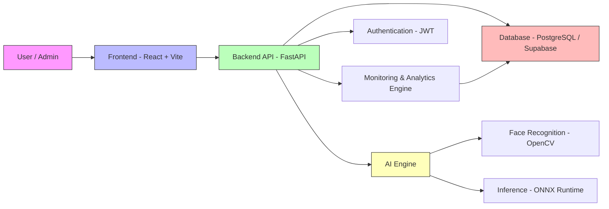

# 🧠 WorkSight AI – Employee Monitoring & Attendance Platform

> 🚀 AI-powered workforce intelligence platform with face recognition, real-time monitoring, and productivity analytics.


---

## 🚀 Features

- Face Recognition-based Attendance  
- Real-time Employee Monitoring  
- Admin & Manager Dashboard  
- Productivity Analytics  
- Secure Authentication (JWT)  
- Supabase / PostgreSQL Support  
- Docker-ready Deployment  

---

## 🧩 Problem It Solves

Traditional systems typically focus on either attendance tracking or activity monitoring — not both.

**WorkSight AI bridges this gap by combining:**

- Identity-based attendance (Face Recognition)  
- AI-driven monitoring insights  
- Centralized workforce management  

---

## 🏗️ Tech Stack

| Layer        | Technologies |
|-------------|-------------|
| **Frontend** | React.js, TypeScript, Vite, Tailwind CSS |
| **Backend**  | FastAPI, SQLAlchemy |
| **AI Layer** | OpenCV, ONNX Runtime |
| **Database** | PostgreSQL / Supabase |
| **Deployment** | Docker, Render, Vercel / Netlify |

---

## 📊 Core Modules

- Dashboard  
- Attendance System  
- Employee Enrollment  
- User Management  
- Monitoring & Analytics  
- System Logs  

---

## 📂 Core Models

- **Employee** – User identity & profile  
- **AttendanceRecord** – Daily attendance  
- **Embedding** – Face recognition vectors  
- **SystemLog** – Logs & diagnostics  
- **ProductivityDaily** – Productivity metrics  

---

## 📊 System Architecture



---

## 🧪 Local Setup

```bash
# Clone repository
git clone https://github.com/Pranav5738/WorkSight-AI.git

# Navigate into project
cd WorkSight-AI

# Install frontend dependencies
npm install

# Run frontend
npm run dev

# Start backend server
uvicorn main:app --reload
```

---

## 🐳 Deployment

- **Backend:** Docker (Render)  
- **Frontend:** Vercel / Netlify / Render  
- **Database:** Supabase / PostgreSQL  

---

## 🛣️ Roadmap

- Role-Based Access Control (RBAC)  
- Async AI processing  
- Advanced analytics dashboard  
- Multi-tenant architecture  

---

## 🤝 Contributing

1. Fork the repository  
2. Create a feature branch  
   ```bash
   git checkout -b feature/your-feature-name
   ```
3. Commit changes  
   ```bash
   git commit -m "Add your message"
   ```
4. Push to GitHub  
   ```bash
   git push origin feature/your-feature-name
   ```
5. Open a Pull Request 🚀  

---

## 📜 License

This project is licensed under the **MIT License**.

---

## 👨‍💻 Author

**Pranav Shah**
